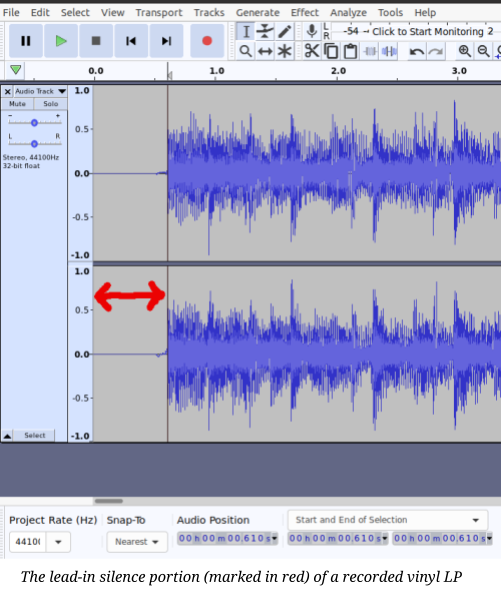
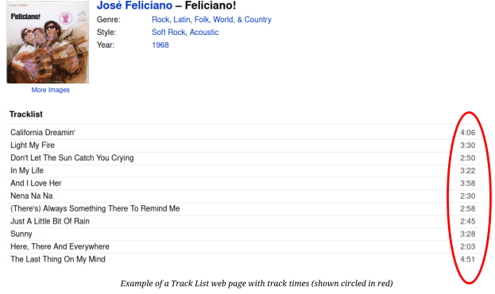
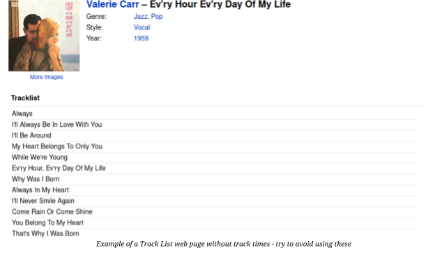
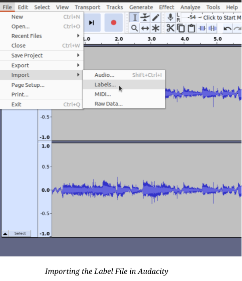
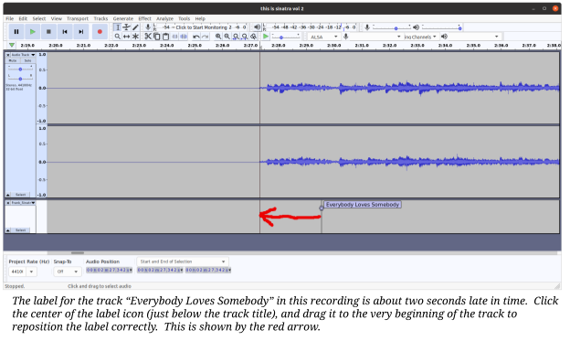
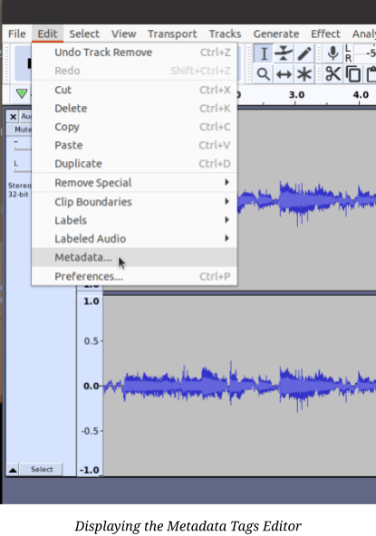
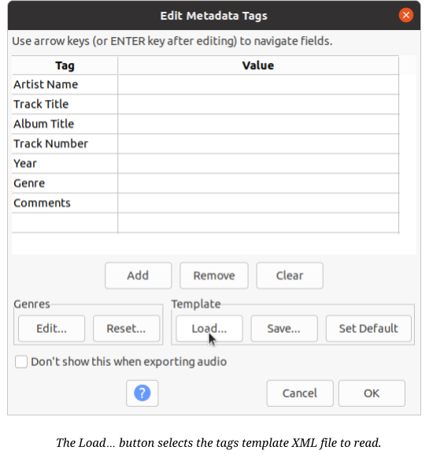

**Developer & Designer: Scott R. Chilcote Software License:
[[GPLv3]{.ul}](https://www.gnu.org/licenses/gpl-3.0.en.html)**
>
**Document Version: 1.1, March 2021**
>
**This document is copyright © 2021 by Scott Chilcote**

[Introduction](#introduction)

[Walkthrough in Brief](#walkthrough-in-brief)

[Using Vinyl Ripper Helper for the First Time](#using-vinyl-ripper-helper-for-the-first-time) 

[VinylRipperHelper is a Python Program](#vinylripperhelper-is-a-python-program)

[Prepare Your Audacity Recording](#prepare-your-audacity-recording) 

[Get the Track List HTML File for the Album](#get-the-track-list-html-file-for-the-album) 

[Run the VinylRipperHelper script](#run-the-vinylripperhelper-script) 

[When the List Has No Track Times](#when-the-list-has-no-track-times)

[Import the Label File](#import-the-label-file)

[Import the Metadata Tags File](#import-the-metadata-tags-file)

[Last Step](#last-step)

[FAQ](#faq)

# Introduction

VinylRipperHelper, or VRH is a Python utility for people who use the free software [Audacity](https://www.audacityteam.org/) application to "rip" vinyl LP records and tapes to digital format. To use VRH in its initial version, one first needs to make a recording of an album that he/she would like to rip. Then one needs to download the tracklist page for the album being ripped from the [Discogs.com](https://discogs.com/) website.

Then run VRH, and it will 1) extract the track list and times, and use them to create the labels that are needed to identify all of the songs on the recording. VRH will also 2) Create a "tags" template file to use with the Audacity metadata editor. This file provides all of the XML tags for the album including the title, artist, genre, year, plus any other tags that were listed for the album in the [discogs.com](https://discogs.com/) tracklist page.

Combined together, these two files substantially reduce the amount of time-consuming data entry required to perform the process for exporting multiple tracks to individual song files with Audacity.

# Walkthrough in Brief

For those who are already familiar with the process of ripping with Audacity's **Export Multiple** function, here are the steps needed to use VRH to label and tag a recording for export.

- Record your album

- To make it a little easier to position the labels, make the following tweaks to the recording: 


> - Delete any "lead-in" time (silence) before the start of the first track

> - If the album has multiple sides, combine them to make one continuous recording

> - Measure the Track Gap (silence between each track), usually 2 to 7 seconds 

> - Make the Side Gap (any silence recorded between two sides) consistent with the track gap - this makes the label placement more accurate

- Perform any processing of the recording with Audacity that you need to clean up the recording; for example, apply Silence to the track gaps if they are noisy, and use the "Click Removal" Effect to make any scratches quieter

- Go to [Discogs.com](https://www.discogs.com/) and find the album that most closely matches the one that you recorded. If there are multiple versions of the album, choose one that has the track times listed after the name of each song or track. Then download it (just the HTML file) to a local directory.

- Place the VinylRipperHelper python program in the same directory and run it. Select the track list HTML file from the displayed list.

- Follow through the prompts VRH displays to get the information that it needs to perform label positioning.

 > ***Note:** If no track list page with time values is available, VRH  will offer to perform a very simple position estimation process to  label the recording. See item #4 in the next section for more  details.*

- Finish the VRH process and save the label list text file and tags XML file to the storage medium. You have the option to accept the default names, or enter your own filenames. The script will add the file extensions (.txt and .xml).

- If you haven't done so yet, open the project file for the album to be ripped in Audacity. Then load the Labels file that VRH created.

This is done as follows:

> - In Audacity's File menu, select **Import \--\> Labels...**

>  - Audacity will display the system file selector, find the Labels file that VRH created and load it.

- At this point two things will happen: 1) the labels track will be added below the audio track for the recording. 2) Audacity will "Zoom Out" automatically to show the entire length of the labels track and recording. *See item #5 in the next section for details on how to reposition the track labels*.

- Adjust each label's position to the beginning of the associated track, as needed.

- Load the Tags XML template file next. To do this, select Audacity's **Edit -> Metadata...**   menu operation.

> - In the Metadata Editor panel, move the cursor to the **Template →
    > Load** button. In the file selector that appears, load the
    > Metadata Tags XML file that VRH created.

```{=html}
<!-- -->
```
12. Review and modify the tags as needed for the recorded album. One
    > tweak that may help is to shorten the list of Genre values, some
    > albums have several.

> This may seem like a lot of steps, but they go much faster than the
> all-manual ripping process. For a more detailed description with
> screen captures, read on.

# Using Vinyl Ripper Helper for the First Time

> If you are not completely familiar with using Audacity to "rip" a
> vinyl album or a tape to multiple MP3, OGG, or WAV files, this section
> of the guide provides greater detail and some screen captures. But
> first, I recommend the excellent documentation provided for Audacity
> users by the Audacity Team for this purpose. If you haven't looked it
> over, that documentation is here:
> <https://manual.audacityteam.org/man/sample_workflow_for_lp_digitization.html>
>
> If you find the density of the information in the above document
> overwhelming, there are some gentler introductions to ripping with
> Audacity at the following websites:

-   At [makeuseof.com](https://www.makeuseof.com/), [author Tim Brooks
    > provides this
    > explanation](https://www.makeuseof.com/tag/record-vinyl-audacity/).

-   At [noterepeat.com](https://www.noterepeat.com/), [this uncredited
    > explanation is
    > available](https://www.noterepeat.com/products/ion/usb-turntables-and-cassette-players/50-converting-vinyl-and-tape-to-mp3-with-audacity).

-   At [turntablelab.com](https://www.turntablelab.com/), [there's
    > another Beginner's
    > Guide](https://www.turntablelab.com/pages/recording-vinyl-into-your-computer-guide).

> There are many more than these if you search for "ripping vinyl with
> Audacity", including several video offerings on Youtube.

## VinylRipperHelper is a Python Program

> If you aren't familiar with the Python 3 computer language and haven't
> installed it on your computer, you may need to take care of that
> first.

-   If you're using a recent version (or distro) of Linux, you're
    > already good to go.

-   If you're using Windows, check out the official documentation for
    > running Python:

    -   <https://docs.python.org/3/faq/windows.html>

    -   There are also youtube.com videos that will guide you through
        > setting up Python on recent Windows releases

-   If you're using a Macintosh, check out the official documentation
    > for Python on the Mac here:
    > <https://docs.python.org/3/using/mac.html>

## Prepare Your Audacity Recording

> Use Audacity to create a single complete recording of your album,
> including all of the sides. There is no reason to make each side a
> separate recording, in fact it makes the ripping process more
> complicated. Audacity's **Export Multiple** feature is designed to
> sequence through all of the tracks and number them, in one pass.
>
> Some tips that will help you perform the ripping process more
> efficiently:

1.  Delete any recorded "lead-in" silence in advance of the first track
    > by clicking and dragging to mark it, and then using Audacity's
    > **Edit → Delete** function to remove it.

> {width="5.239582239720035in"
> height="6.208333333333333in"}

2.  Find the silent portion of the recording between two sequential
    > tracks (e.g. the first and the second track) and note how long it
    > is. This is typically four seconds, but may be as short as two
    > seconds on some albums, and eight seconds (or longer) on others.

> {width="6.481481846019247in"
> height="3.6458333333333335in"}

3.  Find the silent portion of the recording between each side, and
    > adjust it to be the same length. Also note how long this silence
    > is. The **VinylRipperHelper** program will request this
    > information, in order to position the track labels as close to the
    > beginning of each track as possible.

4.  If you plan to do any pre-export improvements to the recording with
    > Audacity, take care of this next. Some examples:

    a.  You can "silence" the gap between each track in the recording if
        > it contains unwanted noise. Control-L is the keyboard
        > shortcut.

    b.  If the record has clicks and pops from wear and tear, you can
        > use the **Click Removal** effect to make these less
        > distracting.

## Get the Track List HTML File for the Album

> Use the search function on discogs.com to identify the album that you
> recorded. You will probably find that there are several matches,
> because for many albums there are versions for different countries, as
> well as multiple edition releases. The important thing is to make sure
> that the track list for the album matches the songs on your recording
> and have the same ordering.
>
> When you find the correct album, examine the track list on the web
> page and make certain that it has the time duration of each track
> listed over to the right of the track title.
>
> If it is not present, see if there's another version of the album that
> includes the track list. If you are not certain what to look for, see
> the image examples below.
>
> {width="6.5in"
> height="3.8541666666666665in"}

{width="6.482479221347331in"
height="3.78125in"}

> When you have the right track list page, save the HTML file to a local
> directory (or folder) on the computer where the VinylRipperHelper
> program will be used.

## Run the VinylRipperHelper script

> When you start the vinylRipperHelper (VRH) script, it will display a
> list of all of the HTML files it finds in the directory where it was
> run. Enter the number of the track list HTML file for the recording to
> be ripped.
>
> After the track list has been read by VRH, you will be prompted for
> the information described in section 4 above. The script will offer
> guesses for each of these questions as default values. If the guess is
> correct, press the Enter key instead of typing in a value.
>
> The requested information items are

-   Lead-in Time recorded

-   If there are no track times listed, you will be offered the option
    > to have the script use a simple estimation instead (see "When the
    > List has No Track Times" below for details)

-   The Track Gap time (seconds of silence between each consecutive
    > track)

> When the last of these requests has been answered, the script will
> build two files and save them to the local directory. These files are
> as shown in the following table.

+--------+------------------------+------------------------------------+
| **File | > **Filename**         | > **Contents**                     |
| Type** |                        |                                    |
+========+========================+====================================+
| Text   | > \<album              | > The label list (location in      |
|        | >-\<artist>-labels.txt | > seconds, track title)            |
+--------+------------------------+------------------------------------+
| XML    | > \<alb                | > The album tag list (artist,      |
|        | um>-\<artist>-tags.txt | > title, year, genre, ...)         |
+--------+------------------------+------------------------------------+

> You have the option to accept the default names for both files, or
> enter your own filenames. The script will add the file extensions
> (.txt and .xml), so you don't need to include that part.

### When the List Has No Track Times

> VRH will let you know if the track list HTML file has no track time
> values. This is not unusual for older albums, and albums that were not
> produced for a large audience. If you get this notification, the best
> solution is to check Discogs.com and see if there's another version of
> the album that has the same track list with track times.
>
> If not, you can still use VRH. It will fall back to producing a label
> list file with evenly spaced tracks. If you choose to proceed, it will
> prompt you for the total length of the recording in minutes. Then it
> will produce a Label File that has the tracks evenly spaced across the
> duration of the album.
>
> After loading this estimated Label File, you will need to reposition
> each label to the beginning of the associated track in Audacity. See
> the next section (Section 5 below) for a detailed explanation.

## Import the Label File

> If you haven't already done so, load the project file for the
> recording to be ripped into Audacity. If there are any enhancements
> that you intend to make to the recording before exporting it, for
> example "Click Removal" to reduce clicks and pops, take care of those
> before proceeding.
>
> {width="5.041666666666667in"
> height="5.833333333333333in"}Import the Label File you made with VRH
> into Audacity using the Import → Labels option in the File menu. This
> is shown in the diagram below.
>
> Importing the label file will cause Audacity to "zoom out" so that the
> entire recording is shown with all of the labels in a new track below
> the audio tracks.
>
> This makes it difficult to make sure that the label positions are
> correct. So at this point, you can select Audacity's **View → Zoom →
> Zoom Normal** option to return the recording to the default level of
> "stretch" (time density?)
>
> At this point it is time to check each label to make sure that it is
> at the beginning of the track to which it pertains. While VRH does a
> pretty good job of calculating where each track starts and placing the
> label nearby, there is almost always some error (except for the first
> track). Note that you can easily move from one label to the next by
> clicking on the label track and using **alt-right arrow** and
> **alt-left arrow** to skip from one label to the next or previous.
>
> A screen capture that shows an example is below.

{width="6.482620297462817in"
height="3.8854166666666665in"}

## Import the Metadata Tags File

> To load the metadata tags for Audacity's Export Multiple function, use
> the Edit → Metadata Editor menu option as shown in the image below.
>
> {width="4.343344269466317in"
> height="6.29in"}
>
> When the metadata tags editor is displayed, select the Load\... button
> in the Template controls box as shown.
>
> {width="5.739583333333333in"
> height="6.0625in"}
>
> After clicking "Load..." a file selector will be shown. Change
> directories to wherever the VRH script was run, and select the tags
> file for the album to be exported.
>
> Make certain that the tags are correct for your recording. The only
> thing that I usually change is if there are several values for
> **Genre** listed, you can fine tune this for your musical tastes.

## Last Step

> The only remaining step is to proceed with the Export Multiple
> process. Click OK if each song looks correct in the Metadata Editor,
> and the task is completed.

# FAQ

1.  **VRH crashed when it read my track list file, who wrote this
    > junk?**

> VRH has not been tested with every track list page on Discogs.com,
> just several dozen of them as of this writing. There are two very
> different tracklist page structures in use that VRH was written to
> handle, but there are likely to be more. Please complete a bug report
> and identify the page that you used when the error occurred. As of
> this writing (March 2021) VRH is pre-release with the expectation that
> further improvement will be required. Thanks for your patience and
> help!

2.  **Discogs.com has a REST API. Why doesn't VRH use that, instead of
    > making me find and download their HTML track list files?**

    1.  VRH started out as a script written for the needs of its author,
        > and it was much quicker to have it parse a local, downloaded
        > HTML file than to obtain permission and an authentication
        > certificate from the Discogs Project. 2) There was no obvious
        > way to design this script to be able to identify a particular
        > album or recording accurately enough to find it on Discogs via
        > their REST API.

> On the other hand, it would certainly improve VRH's efficiency if a
> way to perform its process via the API was developed.
>
> Finding the most suitable track list page from the several that are
> typically available for an album will require some effort. If someone
> has a good idea let me know. It seems likely that VRH would need a
> "Bring me another rock" type capability to fish for the most usable
> version of an album's track list (that also includes the track times).

3.  **I have a great idea for an enhancement to VRH, who do I contact?**
    > Contact the VRH maintainer through the contact link on the
    > https://github.com/ScottCh1/vinyl-ripper-helper web page.

4.  **I have code changes to implement an improvement or bug fix to VRH.
    > Who do I contact?**

> Contact the VRH maintainer through the contact link on the
> https://github.com/ScottCh1/vinyl-ripper-helper web page.

5.  **VRH has saved me hours of precious personal time, how can I
    > express thanks?** Glad you find it useful! If you have coin to
    > spare, please consider making a donation to the Electronic Freedom
    > Foundation or the Free Software Foundation.
